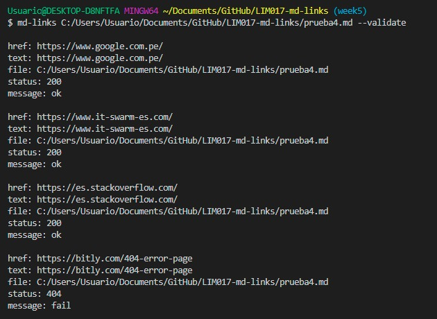
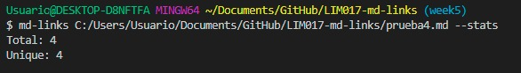
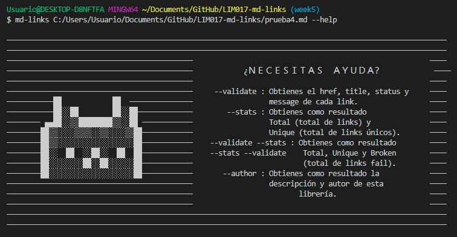
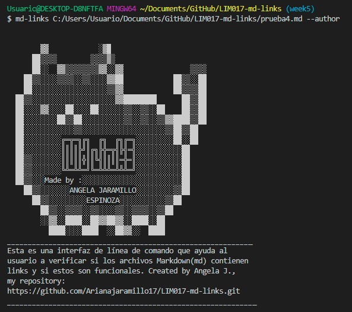

## Índice

* [1. Descripción](#1-Descripción)
* [2. Instalación](#2-Instalación)
* [3. Instrucciones de Uso](#3-Instrucciones-de-uso)
* [4. Herramientas implementadas](#4-Herramientas-implementadas)
* [5. Autora](#5-Autora)


***

## 1. Descripción
Esta es una interfaz de línea de comando que ayuda al usuario a verificar si los archivos Markdown (md) contienen links y si estos son funcionales.
## 2. Instalación

Para instalar Cat-ching mdlinks, inserte en su terminal:

 ```sh
npm i cat-ching-md-links
```
## 3. Instrucciones de uso

 🐱--validate

Si pasamos la opción --validate, el módulo debe hacer una petición HTTP para averiguar si el link funciona o no. Si el link resulta en una redirección a una URL que responde ok, entonces consideraremos el link como ok.

Por ejemplo:

$ md-links ./some/example.md --validate
./some/example.md http://algo.com/2/3/ ok 200 Link a algo
./some/example.md https://otra-cosa.net/algun-doc.html fail 404 algún doc
./some/example.md http://google.com/ ok 301 Google
Lo que se obtiene:


🐱 --stats

Si pasamos la opción --stats el output (salida) será un texto con estadísticas básicas sobre los links.

Por ejemplo:

$ md-links ./some/example.md --stats
Total: 3
Unique: 3
Lo que se obtiene: 


🐱 --stats y --validate 

También podemos combinar --stats y --validate o --validate y --stats para obtener estadísticas que necesiten de los resultados de la validación.

Por ejemplo:

$ md-links ./some/example.md --stats --validate
Total: 3
Unique: 3
Broken: 1
Lo que se obtiene: 


🐱 --help

Si pasamos la opción --help el output (salida) será un cuadro con los comandos disponibles.
Lo que se obtiene:


🐱 --author

Si pasamos la opción --author el output (salida) será una descripcion de la librería y el autor de esta.
Lo que se obtiene:


## 4. Herramientas implementadas

<a href="https://nodejs.org/es/"><li>Node.js</li></a>
<a href="https://nodejs.org/dist/latest-v17.x/docs/api/fs.html#file-system"><li>FS</li></a>
<a href="https://nodejs.org/dist/latest-v17.x/docs/api/path.html"><li>Path module</li></a>
<a href="https://github.com/node-fetch/node-fetch"><li>Node-fetch</li></a>
<a href="https://www.npmjs.com/package/marked"><li>Marked.js</li></a>
<a href="https://www.npmjs.com/package/colors"><li>Colors</li></a>
<a href="https://www.npmjs.com"><li>Npm</li></a>

## 5. Autora

[@Arianajaramillo17](https://github.com/Arianajaramillo17)
